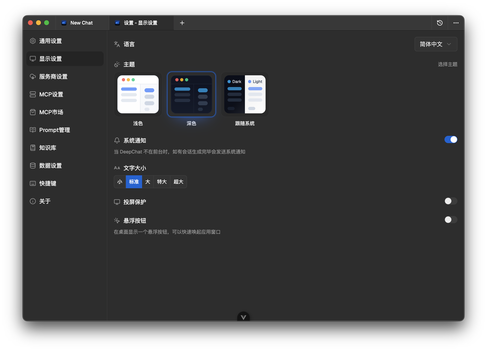

# 重要更新

- 全新的 UI 和 ICON
- 利用 [PublicProviderConf](https://github.com/ThinkInAIXYZ/PublicProviderConf) 项目下发各个供应商的配置信息，在线刷新模型能力，新模型发布第一时间就能适配常规参数
- 使用了能力全面进化的 [vue-markdown-render](https://github.com/Simon-He95/vue-markdown-render) Markdown 渲染库，极其丰富的渲染能力和卓越的性能 
- 全面升级到 tailwindcss v4 和最新的 Shadcn 提供的 ButtonGroup 等新控件，为后续定制主题和一体化的设计演进做好了准备
- 修复了许多奇奇怪怪的 Bug ，具体可以看 GitHub

# 看看图

# 碎碎念部分

自[上次](https://notes.anya2a.com/posts/roadmap-1-0-0.html)说要做一次大的修改和重构，不知不觉一个月过去了，这一个月其实也发布了几个 pre-release 的版本，一方面逐步滚动的推出新的 UI ，另一方面也是做了一些对于 Linux 的更好兼容。

DeepChat 能做到现在的样子，完全离不开开源社区各种优秀的贡献者和他们的作品。包括 PublicProviderConf 虽然是我们在维护的库，但上游一大部分内容依赖了开源项目 [models.dev](https://models.dev/)

另外 vue-markdown-render 这个项目在这个月的迭代也是堪称工业奇迹，基本上是流处理 markdown 的各个库里面一骑绝尘的存在，不管是兼容格式的数量还是性能上。如果大家也有写 ChatBot 类似的需求，刚好在犹豫是 Vue 还是 React ，我觉得你可以试试 https://vue-markdown-renderer.netlify.app/ ，可能是一个让你选择用 Vue 来做这方面的好理由。

当然这个版本依然还是 pre-release ,一方面是样式还没彻底改完，里面还有很多边角的地方没有处理。另一方面有一些新的控件和逻辑还没做上去，之前说的 Agentic 的部分也还没有同步到项目中去，感谢各位用户的使用和反馈，这个对我们帮助真的很大。

另外最近的几个版本对于 Linux 做了一些兼容和微调。这主要是我自己最近把一半时间的开发环境切到了 [Omarchy](https://omarchy.org/) 
Linux 版本去掉了一些为了让用户更加易用减少环境配置的冗余逻辑和内置的程序，更加鼓励用户使用自己系统的工具和环境。另外也做了一些兼容，让整体功能在 Linux 主流的发行版上都能跑的比较顺畅。

这里有个小插曲，因为我们可能是为数不多能在各个 Linux 发行版上跑的很顺畅，并且没有什么特别多的商用限制的 ChatBot ，前段时间 openEuler 在某个展会上的演示机和各种展示清一色的使用了 DeepChat。事前其实我们也并不知道这个事情，刚好有用户看到了告诉了我们，和 openEuler 那边也因此交流了一二，开源项目互帮互助真的是太好了。

# 之后做啥

- 会继续快速发布一些 pre-release 版本，你如果愿意尝鲜，可以在设置关于里面把更新渠道切到内测版本即可
- 模块化和简化整体的程序，甚至可能会去掉一些曾经的功能
- Agent Agent Agent