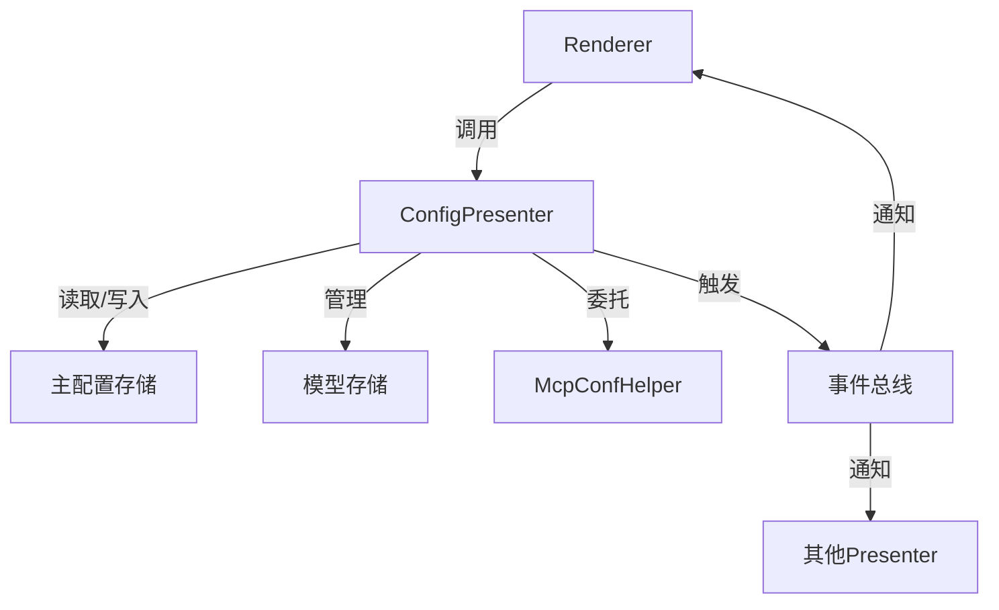

## TL;DR

DeepChat 目前用了如下方案来持久化

- sqlite3-ciphers 保存会话和消息相关数据
- JSON 格式的 Config 文件保存设置项相关数据
- DuckDb 保存知识库数据

## 会话和消息相关数据

这部分数据很好理解，你每一个会话，每次的函数调用，各种和 AI 交互的记录，会话的状态，时间戳排序等等都是写入到 sqlite3 之中。

为什么选择 sqlite3 呢，其实和选择 Electron 的原因差不多，缺点都是可知以及可控制的，但是稳定性和可用性是相对比较好的。另外得益于 [better-sqlite3-multiple-ciphers](https://www.npmjs.com/package/better-sqlite3-multiple-ciphers) 这个很优秀的库，直接加密的问题也解决了，对于企业用户二次开发有安全需求可以快速的适配。

演进方案： [pglite](https://pglite.dev/)  为什么不一开始选择这个呢，其实我是觉得 pglite 是个很好的替代方案，但目前成熟度还是打个问号的，另外就是加密方面似乎没有特别好的内置实现，如果需要自行对数据加解密来解决，那么有点得不偿失，所以暂时只是作为一个未来的演进方案。

虽然 DeepChat 大部分数据可能都在这里，但反而这里的表结构和逻辑都非常简单，只有一些非常常见的CRUD。

## 设置项数据

### 组件交互

### 关键设计点

1. **接口隔离**：通过 IConfigPresenter 接口定义公共API
2. **单一职责**：McpConfHelper 处理MCP相关逻辑
3. **事件驱动**：通过事件总线通知配置变更
4. **版本兼容**：内置数据迁移机制
5. **类型安全**：使用泛型接口保证类型安全

### 具体内容
| 设置项                | 具体描述                     |
|---------------------|----------------------------|
| app-settings        | 应用程序的基本设置             |
| model-config        | 模型的配置选项                |
| custom_prompts      | 自定义Prompts                |
| knowledge-configs   | 知识库的配置                  |
| window-state        | 窗口状态的保存                |
| mcp-settings        | MCP相关的设置                 |
| provider_models     | 各个供应商的API设置            |

其实这里设计的有一点点不合理，比如 mcp 的设置和 prompts 还有模型的设置，都是可以单独开一个表或者 sqlite 库来解决更合适，但是当时考虑到 settings 这个 store 的一致性，所以就放在一起了。

这里的设置大部分就是一个纯粹的 JSON 进行持久化，非常粗糙但是很好用。用了 [electron-store](https://github.com/sindresorhus/electron-store) 这个库去持久化，一开始还担心文件损坏之类的问题，多次测试后发现整体还是很可靠的。

演进方向： 抽取数据量比较大的部分到关系型数据库中处理，然后考虑使用[DexieDB](https://dexie.org/) 来处理剩下的数据，相对于 JSON 文件会更可靠一些。

## DuckDB

其实这里会有个很奇怪的点，DuckDB 其实某种程度可以算是 sqlite3 一个超集。那为什么不直接把 sqlite3 替代了。几个原因，一B是 DuckDB 对于 windows arm 支持的有点小问题，不太好用，另一个还是加密的这块没有特别好的实践数据来支撑选型。

但是有贡献者自己基于 DuckDB 完成了完整的知识库方案，[PR#630](https://github.com/ThinkInAIXYZ/deepchat/pull/630)。所以就索性把 DuckDB 引入进来专门用来给内置知识库做支持。

演进方向：其实 pglite 也是支持向量存储的，后续如果真的迁移到 pglite 的话，这块也是可以一并迁移过去，从而减少整体的性能开销和包大小。

