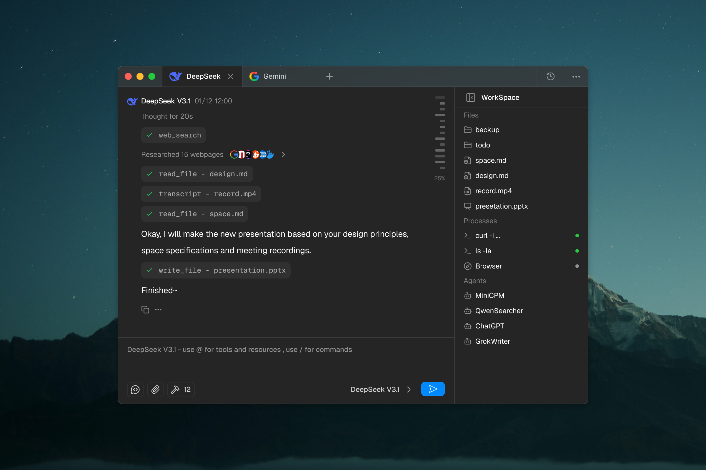

# 写在 DeepChat 停止开发前

# 前尘旧梦

当下，DeepChat 的 ChatBot 能力基本上都是可用的了。虽然 UI 和 UX 上面还有很多值得去迭代和深挖的地方，以及也有很多可以添加的功能。但当下对于 DeepChat 来说显然是要思考下下一步做什么了。

当然，迭代 ChatBot 应用能力是非常好的一个方向，我一直认为国内的几家 ChatBot 的应用产品力都是远超几个 AI 巨头的自家客户端的（当然这是我偏颇的想法）。举个简单的例子，消息分支（fork/branch）这个能力，其实很早就有用户提出来，而且确实是非常好用的能力。国内海外都有用户想要。OpenAI 刚刚加上，而国内的几个 ChatBot 都是半年前就已经习以为常的功能了。

快速的迭代响应，和功能的演化速度都是国内几家 ChatBot 的拿手好戏，但是话又说回来了，一开始 DeepChat 这个项目诞生之初，我们就是要去做 Agent 的，或者说类似 Agent 那样的生产力工具的。只是缺少一个 Vue 的项目给我 fork，缺少一个我喜欢的 Electron 结构的项目去参考，只好从头开始手搓一个。

那现在 ChatBot 能力有了，我们是时候停下来想想下一步做什么了。

# Build In Public

做 DeepChat 的时候和我平时做别的公司产品有个最大的区别就是公开化。曾经一直觉得，我有个好想法，我得先藏起来，然后偷偷做出来惊艳全球（想多了）。所以基于这个想法，在我们还没动手写一行代码前，就得先写个文章立一下 flag，这样才有动力把吹出来的牛逼慢慢去实现。

让我们回到五个月前，刚刚开始为了当时的一个 idea 手搓一个新的 chatbot 的时候，那时候我写了这么一篇文章：

[DeepChat 开发笔记：从0开始薅牦牛毛](https://notes.anya2a.com/posts/deepchat-design-choices-explained)

现在是时候去实现当时的想法了。

> **DeepChat 将会停止开发 ChatBot 相关的功能**

# 弃坑了？

当然不是，只是标题党一下（笑）。目前项目的 ChatBot 能力已经达到够用，但并不丰富的一个状态。而且国内的几家 ChatBot 都做的五彩斑斓五花八门，我非常钦佩这些开发者的能力和成果，他们的很多创新点也是激发我们思考和推进的重要来源。

但回过头看，最开始就不是想做 ChatBot， 只是想有一个自己熟悉的技术栈（Vue + Electron） 以及想验证下 Electron 应用的一些开发思路才去搓 ChatBot ,如果因为这样而一头扎入无穷无尽的 ChatBot 迭代，虽然也不是什么坏事，对于这个项目来说多少还是有点南辕北辙了。

所以我们下一步要去做的是什么呢？

> **教会大家用电脑**

每次和一些优秀的开发者、创作者交流后，发现每个人在使用他们的生产力工具时都真的有非常多的黑科技和小手段。就算都是用 VS Code 写代码，十个人就有十套设置。但人的精力是很有限的，不是每个人都有条件穷举所有可能适合自己的方式去学习一个工具的使用，甚至很多人对电脑并没有太大的钻研兴趣，但又不得不因为工作生活而要去使用。

所以，既然如此，那么我们就来做一个“电脑高手”吧。

# Talk is cheap, show me the design

先放两张路透图。全新的 UI 会在近期上线，然后中长期我们会把 DeepChat 构造成一个"电脑高手"或者说是面向通用世界的IDE。Unix 里面有个哲学叫做 "Everything is a file"（一切皆文件），就像最近各种 CLI 工具的流行，本质上就是模型对于文件的操作和理解。现阶段大家用这个来写代码，并不是因为工具不够好，而是模型对于代码理解足够好，所以效果好。可预见的未来，模型对于文件的操作和理解会越来越成熟，那时候，这种面向通用世界的IDE就会有无穷无尽的可能性了。

# 聊聊 Roadmap 吧

其实详细的计划还没有出来，只是我们刚刚梳理完成了这一整个方向和实现思路。但目前明确知道的顺序大概会如下去处理：

### 1. 切分一个 legacy-chatbot 分支，保留改版前的chatbot状态

这个目的很简单，就希望如果有人需要基于 Vue 或者 Electron 的 ChatBot 开发一些自己的小玩意，有个开箱即用的版本，可以基于这个基座继续开发。

后续如果有安全漏洞或者比较严重的体验漏洞，也会合并到这个分支去，会单独持续维护一段时间

### 2. 开始新的 UI 换皮

科技以换肤为本，希望新皮肤很快能在金丝雀渠道和大家见面

### 3. 暂停新的 feature PR

短期内不会再考虑合并新的功能性PR，直到新的版本雏形完成

### 4. 快速迭代，会有个非常早期的版本提供在金丝雀更新渠道

希望在几周或者一两个月内，就能让大家体验到这一个新的 DeepChat 版本。估计会有海量的 Bug 和问题，但还是感谢大家的支持和使用，希望多多反馈，我们主打一个兼听则明。
